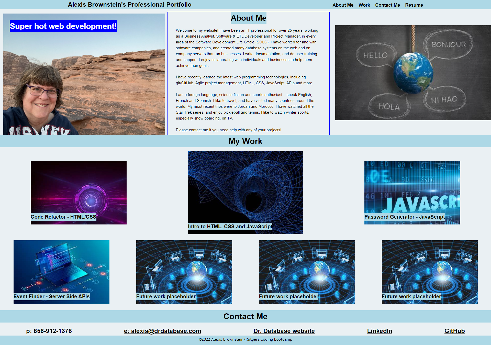

# Mod2AdvCSSPortfolio
# Rutgers Bootcamp Challenge 2 - Professional Portfolio using Advanced CSS

## Description
I created this website to showcase my web development skills to potential employers. 

User Story:
AS AN employer 
I WANT to view a potential employee's deployed portfolio of work samples 
SO THAT I can review samples of their work and assess whether they're a good candidate for an open position 

Acceptance Criteria:
GIVEN I need to sample a potential employee's previous work 
WHEN I load their portfolio 
THEN I am presented with the developer's name, a recent photo or avatar, and links to sections about them, their work, and how to contact them 
WHEN I click one of the links in the navigation 
THEN the UI scrolls to the corresponding section 
WHEN I click on the link to the section about their work 
THEN the UI scrolls to a section with titled images of the developer's applications 
WHEN I am presented with the developer's first application 
THEN that application's image should be larger in size than the others 
WHEN I click on the images of the applications 
THEN I am taken to that deployed application 
WHEN I resize the page or view the site on various screens and devices 
THEN I am presented with a responsive layout that adapts to my viewport 

## Table of Contents

- [Description](#description)
- [Installation](#installation)
- [Usage](#usage)
- [Credits](#credits)
- [License](#license)
- [Badges](#badges)
- [Features](#features)
- [How-to-Contribute](#how-to-contribute)
- [Tests](tests)

## Installation

I used VS Code software to edit code and git/Terminal to push changes to GitHub.  

## Usage

Here's a link to my website stored in GitHub:
https://abrownstein2022.github.io/Mod2AdvCSSPortfolio

Here's a screenshot of my final webpage from a browser:
    

    

## Credits
N/A

## License

N/A

## Badges

N/A

## Features

The main features in this project are:
1. My name, a recent photo and links to info about me, my work and how to contact me appear on this website
2. I created the website using Semantic, responsive HTML code and advanced CSS, including flexboxes
3. Project links open in a new window
4. Different color appears when hovering over a text link
5. Clicking on a link in the navigation takes you to that section on the website
6. The first application in the course shows as a larger box than the subsequent projects

## How-to-Contribute

N/A

## Tests

I used ChromeDevTools to help debug issues.  I tested all the links and features, ie. hover, opening the project links in a new window, and pointing to the correct images from the nav.